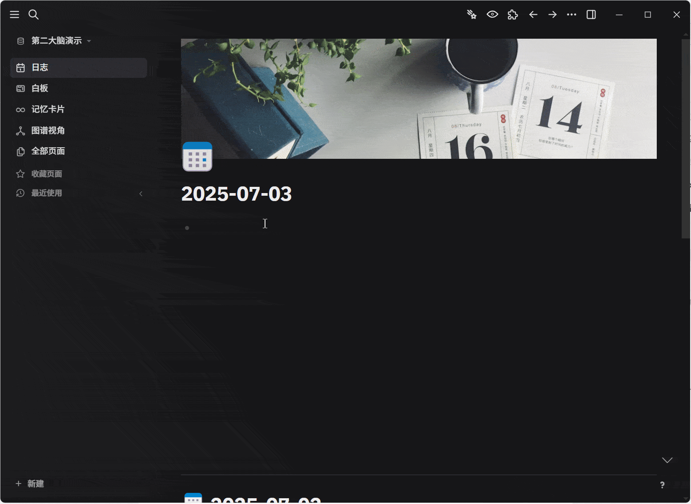

# Logseq 图片自动压缩插件
> 粘贴图片到笔记时，自动转换为 WebP/AVIF 格式

**📚 系列博客 / Blogs**

* [实战教你如何开发自己的 Logseq 插件：自动压缩粘贴的图片](https://blog.csdn.net/ssrc0604hx/article/details/148903071)

**📽️ 演示 / How To Use**

## 🌟 功能日志 / CHANGELOG

### v25.7.7
* 首个版本 🎉
* 支持转换为 webp/avif、配置存放目录
